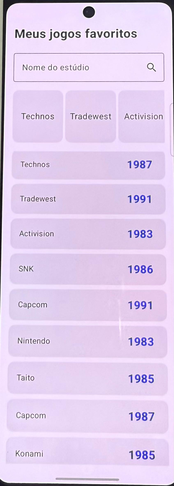
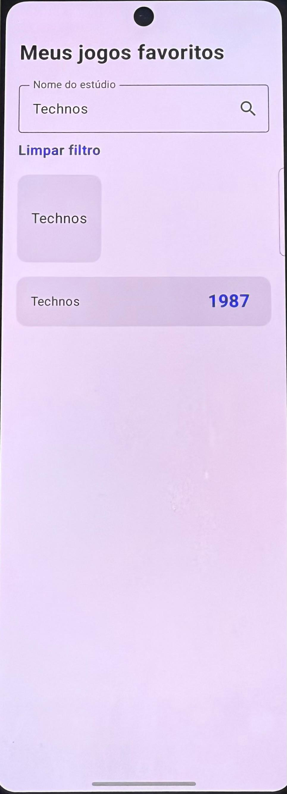

# Fundamentos Jetpack Compose - Listas Lazy

Aplicativo Android desenvolvido em Kotlin, utilizando **Jetpack Compose**, criando **listas dinâmicas**, utilizando o componente `LazyColumn` no Android.  
O repositório demonstra como exibir dados de forma eficiente, organizar itens em cartões personalizados e aplicar boas práticas de arquitetura no desenvolvimento mobile.

## Objetivos do Projeto

- Praticar os fundamentos do **Jetpack Compose**.
- Implementar **listas lazy** para renderização performática.
- Criar **componentes reutilizáveis** com `@Composable`.
- Aplicar **themes** e estilização consistente.
- Exercitar versionamento com **Git/GitHub** seguindo boas práticas.

---

## Tecnologias Utilizadas

- **Kotlin**
- **Android Studio**
- **Jetpack Compose**
- **Material 3 (Material You)**
- **Preview Annotations** (`@Preview`)
- **Git/GitHub** (GitFlow: `develop` + `main`)

---

## Estrutura do Projeto

- `model/` → Contém a classe `Game`, representando a entidade exibida na lista.
- `components/` → Contém os componentes reutilizáveis (`GameCard` e `StudioCard`).
- `ui/theme/` → Configuração de **cores, tipografia e temas** do app.
- `MainActivity.kt` → Ponto de entrada do aplicativo.

---

## Branches e Fluxo de Trabalho

- Branch principal de desenvolvimento: **`develop`**
- Branch da versão estável do projeto: **`main`**
- Fluxo Resumido: develop -> (Pull Request) -> main

---

## Participantes

- **Gustavo Carvalho** – RM 550983
- **Leticia Vitalino** – RM 552481
- **Bruno Granado** – RM 551411

---

## Demonstração do APP

<p align="center">
  
  
</p>

---

## Como Executar

1. Clone o repositório:
   ```bash
   git clone https://github.com/ogustavoress/fundamentos-jetpack-compose-listas-lazy.git
2. Abra o projeto no **Android Studio**
3. Sincronize as dependências do **Gradle**
4. Rode no emulador ou dispositivo físico com **API 34+**
